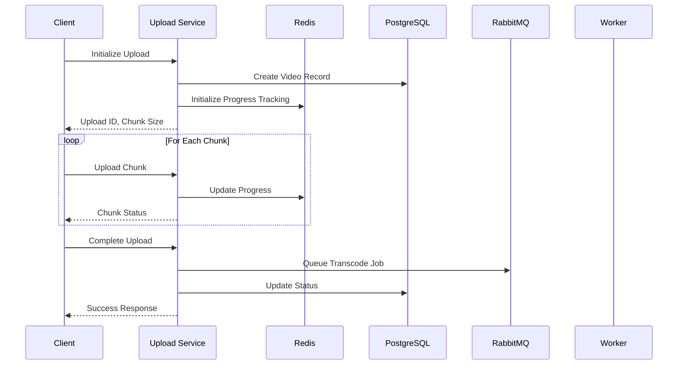
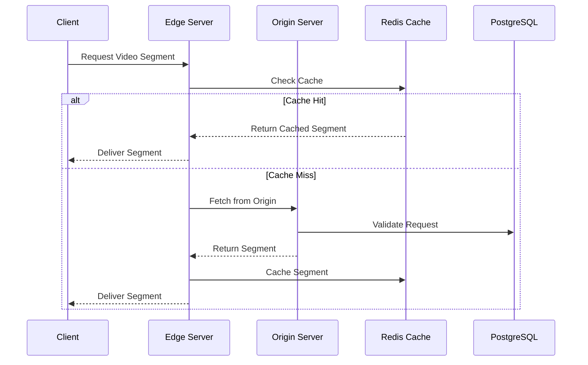

# System Architecture

## Architecture Diagram

## OSI Model Layer Analysis

### Layer 7 (Application)
- HTTP/2 for uploads and streaming
- WebSocket for real-time progress updates
- RTMP/HLS/DASH for video streaming
- REST APIs for metadata

### Layer 6 (Presentation)
- Video codec handling (H.264, VP9)
- TLS encryption
- JSON for API responses
- Binary for video chunks

### Layer 5 (Session)
- Upload session management
- Viewer session tracking
- Worker connection pools
- Cache coherence

### Layer 4 (Transport)
- TCP for reliable transfers
- UDP for live streaming
- Connection multiplexing (HTTP/2)
- Load balancer health checks

### Layer 3 (Network)
- CDN edge routing
- Inter-service communication
- Container networking
- Health check routing

### Layers 1-2 (Physical/Data Link)
- Container network interfaces
- Host network bridging
- Docker overlay networking
- Physical infrastructure (handled by deployment platform)

## Key Flows

### Upload Flow (Chunked)

### Video Playback Flow

## Design Decisions & Trade-offs

### Upload Approaches

#### HTTP/2 Streaming
Pros:
- Lower memory usage (streaming)
- Simpler implementation
- Native flow control

Cons:
- Less resilient to failures
- No parallel uploads
- Limited progress tracking

#### Chunked Upload
Pros:
- Resumable uploads
- Better failure handling
- Parallel processing
- Detailed progress tracking

Cons:
- Higher complexity
- More storage overhead
- State management needed

### Worker Patterns

#### Pull-based Workers
Pros:
- Self-regulating load
- Simple implementation
- No overload issues

Cons:
- Higher latency
- Less efficient distribution
- More database load

#### Push-based Workers
Pros:
- Lower latency
- Efficient distribution
- Real-time processing

Cons:
- Need backpressure handling
- More complex scaling
- Potential overload

### Content Delivery

#### Edge Caching
Pros:
- Better global performance
- Reduced origin load
- Lower viewer latency

Cons:
- Complex cache invalidation
- Higher infrastructure cost
- Cache coherence challenges

#### Reverse Proxy Cache
Pros:
- Simpler implementation
- Local optimization
- Easy cache control

Cons:
- Single point of caching
- Limited geographical benefit
- Higher origin load

## Pattern Choices

### Repository Pattern
Used for database access to:
- Abstract data access
- Simplify testing
- Enable caching
- Standardize queries

### Circuit Breaker
Implemented for external services to:
- Handle failures gracefully
- Prevent cascade failures
- Enable degraded operation
- Manage recovery

### Publisher/Subscriber
Used for event handling to:
- Decouple components
- Scale independently
- Enable event replay
- Facilitate monitoring

### Command Query Responsibility Segregation (CQRS)
Applied to video metadata to:
- Optimize read/write paths
- Scale reads independently
- Enable caching
- Simplify queries

## Scaling Considerations

### Upload Service
- Horizontal scaling
- Stateless design
- Shared storage backend
- Load balancer distribution

### Transcoding Workers
- Auto-scaling groups
- Resource-based scaling
- Queue-length triggers
- GPU optimization

### Content Delivery
- Geographic distribution
- Cache hierarchies
- Load-based routing
- Cache warming

### Database
- Read replicas
- Partitioning
- Connection pooling
- Query optimization

## Future Improvements

1. **Reliability**
   - Multi-region deployment
   - Automatic failover
   - Cross-region replication
   - Zero-downtime updates

2. **Performance**
   - WebAssembly transcoding
   - P2P delivery option
   - Predictive caching
   - Adaptive bitrates

3. **Scalability**
   - Kubernetes migration
   - Serverless functions
   - Edge computing
   - Microservices split

4. **Monitoring**
   - Distributed tracing
   - Metrics aggregation
   - Anomaly detection
   - Performance alerts