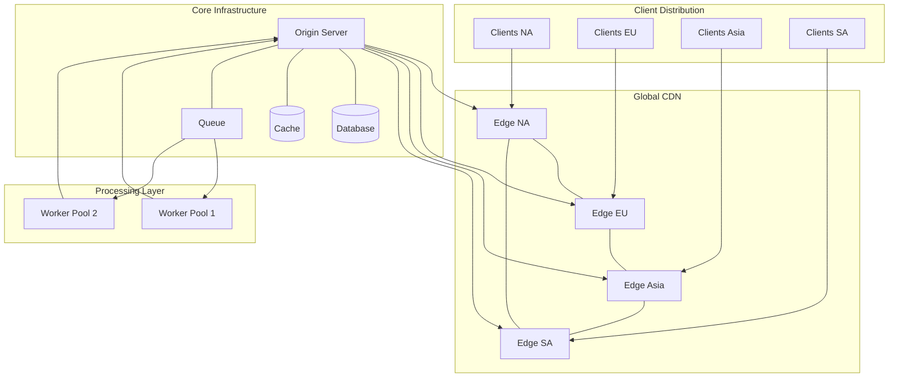

```mermaid
graph TB
    subgraph "Global CDN"
        E1[Edge NA] --- E2[Edge EU]
        E2 --- E3[Edge Asia]
        E3 --- E4[Edge SA]
        E4 --- E1
    end

    subgraph "Core Infrastructure"
        O[Origin Server] --> E1
        O --> E2
        O --> E3
        O --> E4
        
        O --- DB[(Database)]
        O --- C[(Cache)]
        O --- Q[Queue]
    end

    subgraph "Processing Layer"
        Q --> W1[Worker Pool 1]
        Q --> W2[Worker Pool 2]
        W1 --> O
        W2 --> O
    end

    subgraph "Client Distribution"
        C1[Clients NA] --> E1
        C2[Clients EU] --> E2
        C3[Clients Asia] --> E3
        C4[Clients SA] --> E4
    end
```