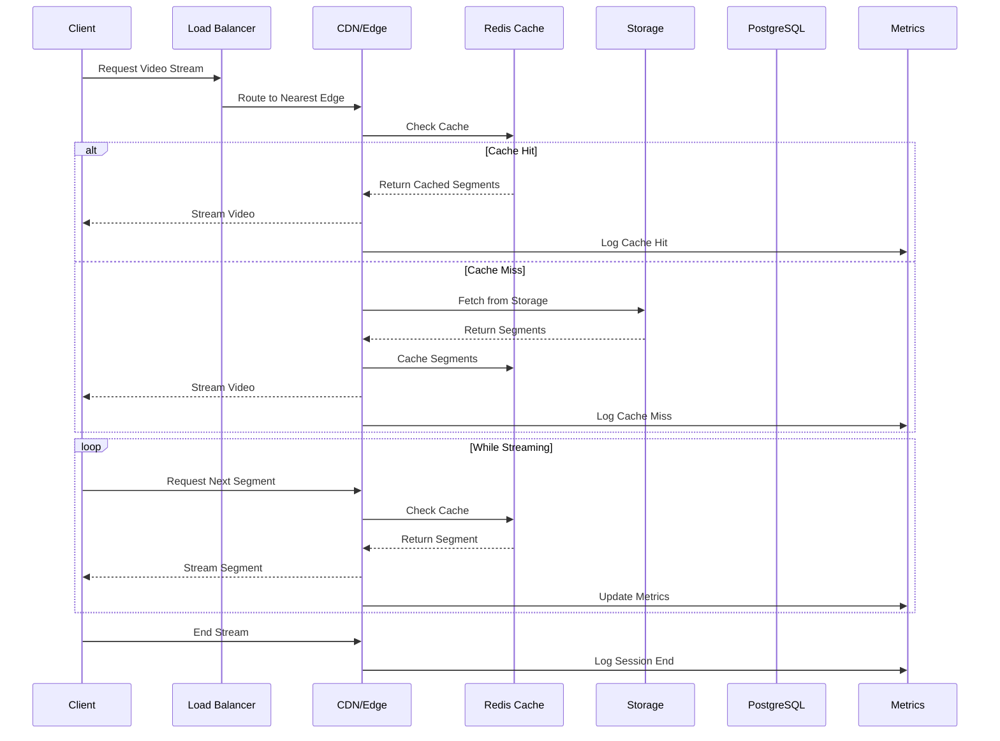

```mermaid
sequenceDiagram
    participant C as Client
    participant LB as Load Balancer
    participant CDN as CDN/Edge
    participant RC as Redis Cache
    participant S as Storage
    participant DB as PostgreSQL
    participant M as Metrics

    C->>LB: Request Video Stream
    LB->>CDN: Route to Nearest Edge
    
    CDN->>RC: Check Cache
    
    alt Cache Hit
        RC-->>CDN: Return Cached Segments
        CDN-->>C: Stream Video
        CDN->>M: Log Cache Hit
    else Cache Miss
        CDN->>S: Fetch from Storage
        S-->>CDN: Return Segments
        CDN->>RC: Cache Segments
        CDN-->>C: Stream Video
        CDN->>M: Log Cache Miss
    end

    loop While Streaming
        C->>CDN: Request Next Segment
        CDN->>RC: Check Cache
        RC-->>CDN: Return Segment
        CDN-->>C: Stream Segment
        CDN->>M: Update Metrics
    end

    C->>CDN: End Stream
    CDN->>M: Log Session End
```