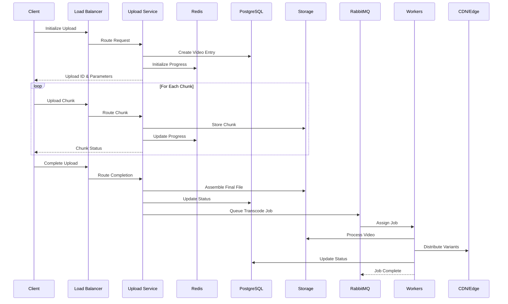

```mermaid
sequenceDiagram
    participant C as Client
    participant LB as Load Balancer
    participant US as Upload Service
    participant R as Redis
    participant DB as PostgreSQL
    participant S as Storage
    participant RMQ as RabbitMQ
    participant W as Workers
    participant CDN as CDN/Edge

    C->>LB: Initialize Upload
    LB->>US: Route Request
    US->>DB: Create Video Entry
    US->>R: Initialize Progress
    US-->>C: Upload ID & Parameters

    loop For Each Chunk
        C->>LB: Upload Chunk
        LB->>US: Route Chunk
        US->>S: Store Chunk
        US->>R: Update Progress
        US-->>C: Chunk Status
    end

    C->>LB: Complete Upload
    LB->>US: Route Completion
    US->>S: Assemble Final File
    US->>DB: Update Status
    US->>RMQ: Queue Transcode Job

    RMQ->>W: Assign Job
    W->>S: Process Video
    W->>CDN: Distribute Variants
    W->>DB: Update Status
    W-->>RMQ: Job Complete
```