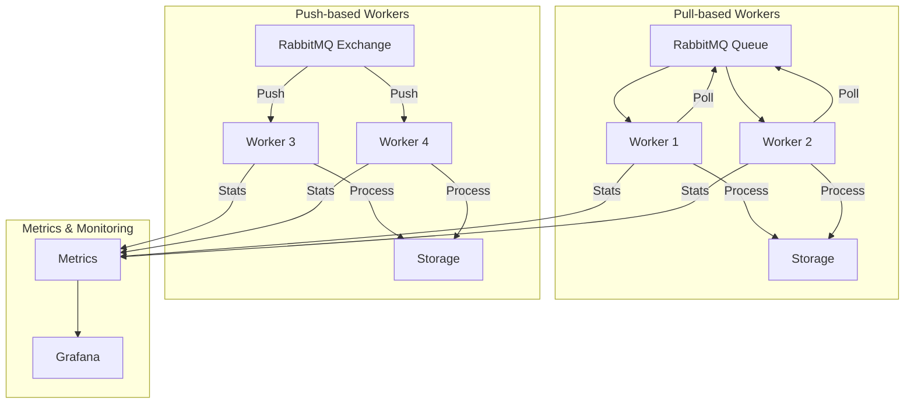

```mermaid
graph TB
    subgraph "Pull-based Workers"
        direction TB
        Q1[RabbitMQ Queue] --> W1[Worker 1]
        Q1 --> W2[Worker 2]
        W1 --> |Poll| Q1
        W2 --> |Poll| Q1
        W1 --> |Process| S1[Storage]
        W2 --> |Process| S1
    end

    subgraph "Push-based Workers"
        direction TB
        Q2[RabbitMQ Exchange] --> |Push| W3[Worker 3]
        Q2 --> |Push| W4[Worker 4]
        W3 --> |Process| S2[Storage]
        W4 --> |Process| S2
    end

    subgraph "Metrics & Monitoring"
        W1 --> |Stats| M[Metrics]
        W2 --> |Stats| M
        W3 --> |Stats| M
        W4 --> |Stats| M
        M --> G[Grafana]
    end
```